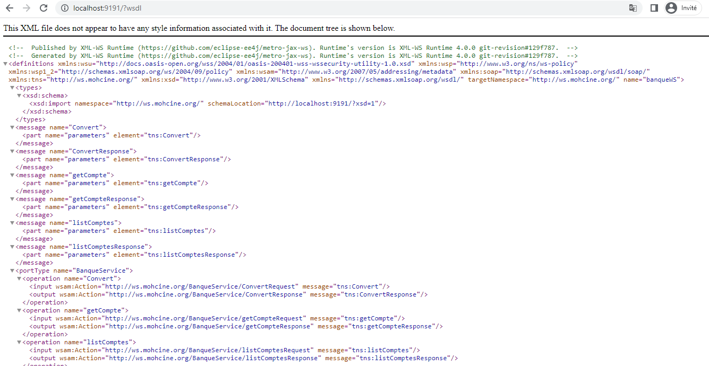
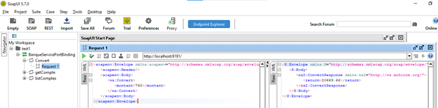
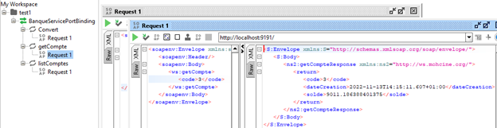
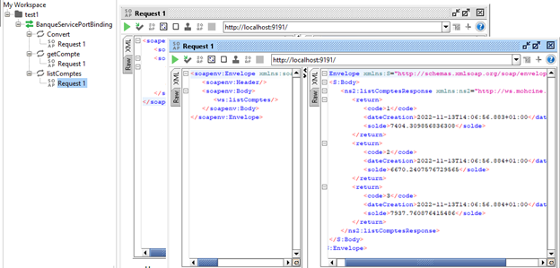

<h1>Activité Pratique N° 2 : Web services SOAP, WSDL, UDDI avec JAXWS</h1>
<h2>1. Creation du Web service</h2>
<h3>Classe Compte</h3>

<h3>Classe BanqueService</h3>

<h3>Classe Server</h3>

<h2>2. Consulter et analyser le WSDL avec un Browser HTTP</h2>

<h2>3. Tester les opérations du web service avec SoapUI</h2>
<h3>Test</h3>

<h3>@XmlTransient</h3>

<h3>Client SOAP Java</h3>

