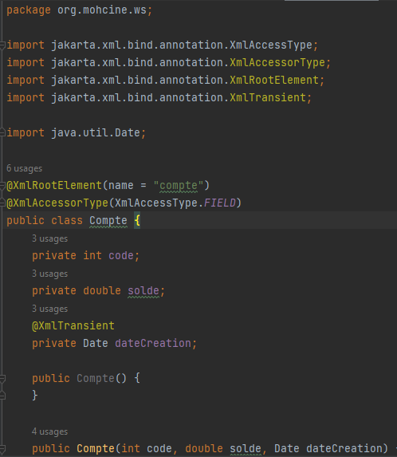
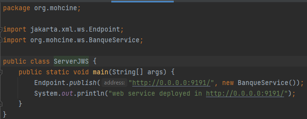
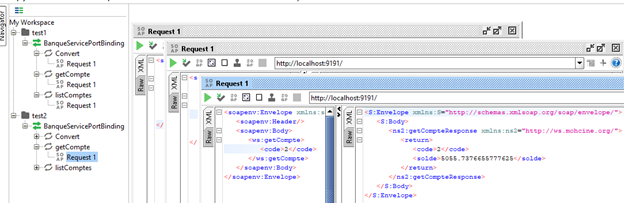
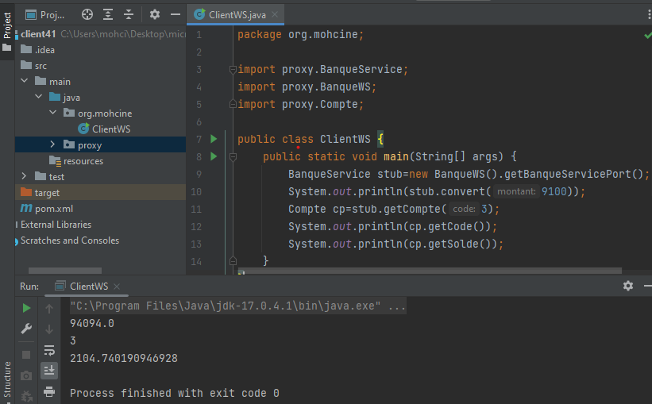

# Activité Pratique N° 2 : Web services SOAP, WSDL, UDDI avec JAXWS

## 1. Creation du Web service
### Classe Compte

### Classe BanqueService

### Classe Server

## 2. Consulter et analyser le WSDL avec un Browser HTTP

## 3. Tester les opérations du web service avec SoapUI

&#8594; TEST

&#8594; @XmlTransient

** **

&#8594; Client SOAP Java

